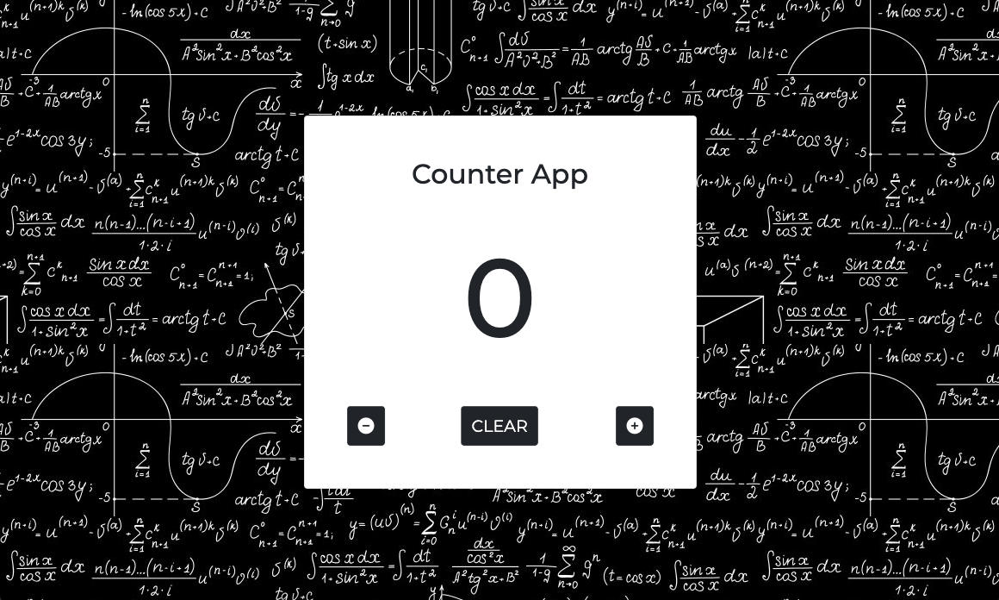

# Counter App
Una volta aperta, l'applicazione si presenta con un numero 0 e tre bottoni sotto di esso: 
il tasto - decrementa il numero di un'unità 
il tasto "clear" azzera il numero 
il tasto + aumenta di un'unità.

PS: se clicchi sul tasto meno quando c'è il numero 0, il numero non diminuirà.

# Aspetto

# Installazione
Per aprire l'app apri il terminale, individua il percorso che preferisci  ed inserisci questo comando:
git clone (`https://github.com/parrodiv/Js_Basics_Project.git`)
